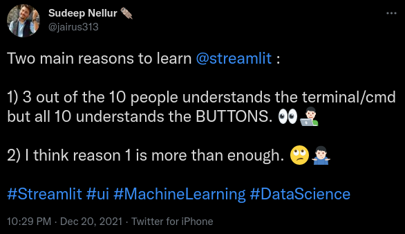
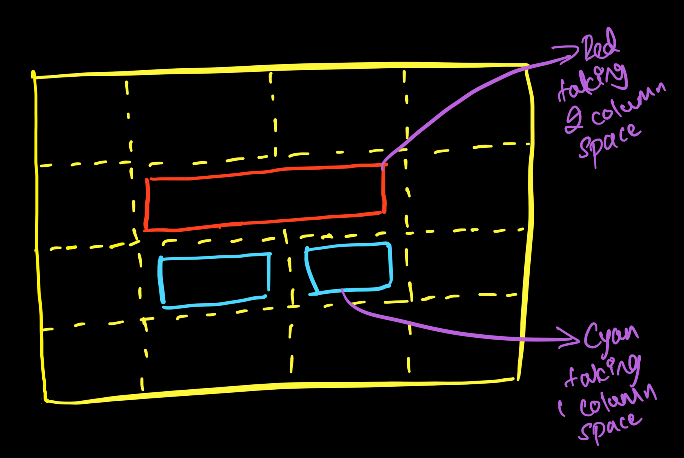
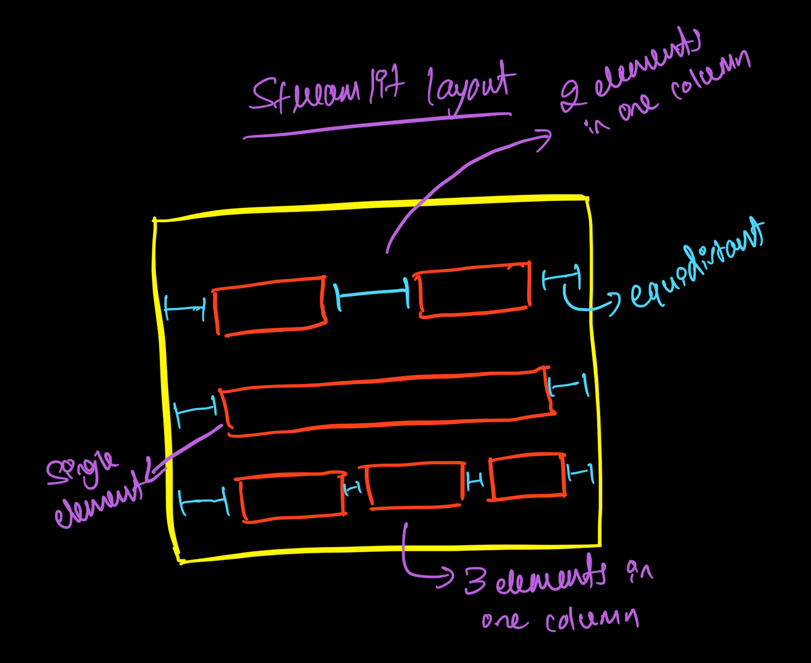

## Hey There..! I am **[Sudeep Nellur](https://sudeepnellur.tech/)** aka **[Jairus313](https://sudeepnellur.tech/)** :sunglasses:. Here I am writing this little crash course about **[Streamlit.io](https://streamlit.io/)** which will be more than enough for you to get started and start rolling out some cool apps. So let's wrap our head around it now.!

  
## About Streamlit..!

Before starting with it but first let's answers some general questions.

Q. What is the Streamlit.io?</br>
A. Streamlit.io is the app framework for machine learning and data science solution where you can write few lines of python code and get your app up running within minutes and you can host too if you want to share with your friends. More on refer [Streamlit.io](streamlit.io)</br></br>

Q. Why Streamlit.io or UI in general needed?</br>
A. 

Q. What are the pre-requisites?</br>
A. Streamlit is python framework, So Python is must and enough but if you already know Python GUIs like PyQt or TKinter and HTML then it would be a breeze.

With these being clear to you, let's get started and feel free to jump around on the topic with which you are interested.

<hr>

## Index

- [Installation and Get started](#Installation)
- [General Synatx](#general_syntax)
- [Markdowns](#markdown)
- [Latex](#latex)
- [Write](#write)
- [Display](#display)
- [Plots](#plot)
- [Media](#media)
- [Widgets](#widgets)
- [Sidebars](#sidebars)
- [Animations](#animations)
- [Layouts](#layout)
- [Building a Portfolio](#portfolio)

<hr>

<a  id="Installation"></a>
### Installation and Get started

Before you start installing the streamlit which is super easy to install but make sure that you have got python package manager installed properly. If this is checked then open your terminal or cmd and run the below command.

```sh
# for windows.
pip install streamlit

# for linux.
pip3 install streamlit
```

This is will take a little while and after successfully installed, You can check your installation by running the below command. And this will take you to home page of streamlit which indicates that everything installed properly.

```sh
streamlit hello
```

**Note:** Streamlit in background uses protobuf as it's internal dependencies, Install Google protobuf before installing streamlit first. For more refer this [link](https://stackoverflow.com/questions/61922334/how-to-solve-attributeerror-module-google-protobuf-descriptor-has-no-attribu) .

Now that you have installed it properly, Create python script and write the below code.

```python
# importing library, will be using it as "st" throughtout the blog.
import streamlit as st

# Just a title, will get on this later.
st.title('Just a title')
```

Save this script then open the terminal and run below the command which will make the app to boot up and this will open your browser for it.

```sh
streamlit run your_script_name.py
```

And you would able to see the title in your web browser and that's it.

<hr>

<a  id="general_syntax"></a>
### General Syntax

Streamlit is very simple and straight forward App framework when it comes to syntax and building apps, the syntax follows as below.

```python
st.<element_name>(<value>)
```

Here;

 - **st**: Streamlit class instance
 - **element_name**: Widget/Component
 - **value**: Value for that element

Example:
```python
# importing library.
import streamlit as st

# title is the fucntion for titles and yes I've just embedded emoji right away.
st.title('Jairus313 - This is my made up name :sunglasses:')
```

As above mentioned code, we will be importing the **streamlit** as **st** for convenience and next we will create title which is h1 tag in html by calling the function **title**  and that will be taking one required parameter which is text and yes, you can add emoji too.  Here let's us save this code as **script.py** and run the below command to boot up.

```sh
streamlit run script.py
```

And that's it, Your app will be up and running and this syntax will remains same with little modification which makes streamlit a very handy framework to get started. And to stop, just go back to the terminal/cmd and hit `ctrl+ c`.

<hr>

<a  id="markdown"></a>
### Markdowns

Markdown is a light-weight markup language which will be used to build up some visually appealing documentation with some simple text. Here markdown is supported in streamlit which will give more control to the developer and for more do refer this [link](https://www.markdownguide.org/getting-started/). Let's have a look on some below.

Syntax:
```sh
st.markdown(" your markdown ")
```

Code Example:
```python
# importing library.
import streamlit as st

# and you have more control, If you use markdown syntax.
st.markdown("""
	# h1 tag
	## h2 tag
	### h3 tag
	#### h4 tag
	##### h5 tag
	###### h6 tag
	""")

## bold text.
st.markdown("Some **Bold** text")

# italic text.
st.markdown("Some _Italic_ text")

# strikethrough text.
st.markdown("Some ~~strikethrough~~ text")
```

<hr>

<a  id="latex"></a>
### Latex

Latex are fun and interesting typesetting system and this will be used most in technical and scientific documentation, to put up everything in simple terms it's all those wizard/greek signs or equations that you see in documentations. For more do refer this [link](https://typeset.io/resources/learn-latex-beginners-step-by-step-guide/)

Syntax:
```sh
#"r" for reading it as text.
st.latex(r''' your greek equation ''')
```

Code Example:
```python
# importing library.
import streamlit as st

# latex
# Do run this code by yourself to see the equation.;)
st.latex(r'''
	x^2 = \frac{n^2+n}{10}
	''')

st.latex(r'''
	a + ar + a r^2 + a r^3 +  \cdots + a r^{n-1} =
	\sum_{k=0}^{n-1} ar^k =
	a \left(\frac{1-r^{n}}{1-r}\right)
	''')
```

<hr>

<a  id="write"></a>
### Write

Streamlit's write is basically a terminal in the app itself and it is the most powerful function since it acts as the terminal. Here you can do many things like printing your output to plotting up the graphs. Let's have a look on it.

Syntax:
```sh
st.write("output")
```

Code Example:
```python
# importing library.
import streamlit as st
import pandas as pd
import numpy as np

# to print anything using write.
st.write(1234)

st.write("# Can be used as markdown too.")

st.write("sum of two values", 2+2)

# can display the arrays too.
data = pd.DataFrame(np.array([[1, 2, 3], [4, 5, 6], [7, 8, 9]]),
columns=['a', 'b', 'c'])

# you can add up multiple things in go also.
st.write("before the dataframe", data, "after the dataframe")
```

<hr>

<a  id="display"></a>
### Display

As the name suggests this function will display all the tables, arrays, json and also some cool metrics too.

Syntax:
```sh
# dataframes/array.
st.dataframe("dataframe")

# tables.
st.table("tables")

# json.
st.json({"your":"json"})

# metrics.
st.metric(label="label", value="value", delta="percentage")
```

Code Example:
```python
# importing library.
import streamlit as st
import pandas as pd
import numpy as np

# dataframe.
# values in 2D array with column as names.
df = pd.DataFrame(
	np.array([["Sudeep Nellur", "Machine Learning Engineer", "https://sudeepnellur.tech/"]]),
	columns=("Name", "Desgination", "Portfolio"))

st.dataframe(df)

df = pd.DataFrame(
np.random.randn(10, 10),
columns=('col %d' % i for i in range(10)))

st.dataframe(df)

# tables.
# in table everything will be displayed
st.table(df)

# some cool metric.
st.metric(label="Petrol", value="100 ₹", delta="+10%")

# some json too.
st.json({
	"id": "0001",
	"type": "donut",
	"name": "Cake",
	"ppu": 0.55,
	"batters":{
		"batter":[
			{ "id": "1001", "type": "Regular" },
			{ "id": "1002", "type": "Chocolate" },
			{ "id": "1003", "type": "Blueberry" },
			{ "id": "1004", "type": "Devil's Food" }
		]},
		"topping":[
			{ "id": "5001", "type": "None" },
			{ "id": "5002", "type": "Glazed" },
			{ "id": "5005", "type": "Sugar" },
			{ "id": "5007", "type": "Powdered Sugar" },
			{ "id": "5006", "type": "Chocolate with Sprinkles" },
			{ "id": "5003", "type": "Chocolate" },
			{ "id": "5004", "type": "Maple" }
			]
		}
	)
```

<hr>

<a  id="plot"></a>
### Plots

Streamlit plots are as similar as the display, Here instead of tables we will display the graphs, plots and diagrams too. Some of them are line charts, area charts, bar charts and many more.

Syntax:
```sh
# line chart
st.line_chart("chart_data")

# area chart
st.area_chart(chart_data)

# bar chart
st.bar_chart(chart_data)

# diagram
st.graphviz_chart("graph object")
```

Code Example:
```python
# importing library.
import streamlit as st
import pandas as pd
import numpy as np


# line chart
chart_data = pd.DataFrame(
np.random.randn(20, 3),
columns=['a', 'b', 'c'])

st.line_chart(chart_data)

# area chart
chart_data = pd.DataFrame(
np.random.randn(20, 3),
columns=['a', 'b', 'c'])

st.area_chart(chart_data)

# bar chart
chart_data = pd.DataFrame(
	np.random.randn(50, 3),
	columns=["a", "b", "c"])

st.bar_chart(chart_data)

# flow chart
st.graphviz_chart('''
	digraph {
		start_new_project -> plan_to_learn_new_skills
		plan_to_learn_new_skills -> too_many_skills_to_learn
		too_many_skills_to_learn -> abandon_the_project
		abandon_the_project -> start_another_new_project
		start_another_new_project -> plan_to_learn_new_skills
		plan_to_learn_new_skills -> accidently_learn_all_those_new_skills
		accidently_learn_all_those_new_skills -> complete_the_project
		complete_the_project -> open_source_the_project
		}
	''')
```

<hr>

<a  id="media"></a>
### Media

Streamlit also allows us to add-in media files like images, audios and videos. And the best part about it is that you don't necessarily need to have the media file stored inside your system but you can just add in the media files via url also.

Syntax:
```sh
# image file.
st.image("file_name or link")

# video file.
st.video("file_name or link")

# bar chart
st.audio(("file_name or link")
```

Code Example:
```python
# importing library.
import streamlit as st

# existing image
st.image("image.jpeg")

# image via link
st.image("https://pbs.twimg.com/profile_images/1366779897423810562/kn7ucNPv_400x400.png")

# exisiting video
st.video("video.mp4") 

# video via link
st.video("https://www.youtube.com/watch?v=EDQeVhG-68Y")

# audio
st.audio("audio.mp3")
```

<hr>

<a  id="Widgets"></a>
### Widgets

So We finally reached to this part. Streamlit Widgets are one of the necessary topic since we can take a lot of inputs from the user using these. Following are the some of the important widgets and each widget has it's own functionality depending upon the requirements.

 - **Buttons**: As the name says it's a button. Certain operation is performed when a button is pressed or triggered. Button as default will return false and when it is pressed it will return true.
 
	 Syntax:
	```sh
	st.button("button value")
	```
	
 - **Text Inputs**: Here we can accept the text input from the user. Basically it will store the input of the user which is entered in the dialog box and you can easily access it by assigning a variable.
 
	 Syntax:
	```sh
	st.text_input("text label")
	```
	
 - **Text Area**: Text area is as similar as the text input but here you can take up the lengthier inputs such as customer's feedback. The Dialog box will be much bigger than text input's dialog box and it can be also accessed via assigning a variable.
 
	 Syntax:
	```sh
	st.text_area("text label")
	```
	
 - **Check Boxes**: These are square boxes with message infront of it, usually you see this in terms and conditions agreement where you just blindly select the box and hit enter. By default these will be false and you modify it to vice versa also.
 
	 Syntax:
	```sh
	# value is default value.
	st.checkbox("message", value=True or False)
	```
	
 - **Radio Buttons**: Radio buttons are similar as checkboxes where user can just select it but here these will be in circle shape and user can only choose one in multiple choices. Usually you will see these types in the online forms while selecting one from multiple options.

	Syntax:
	```sh
	# index is default value.
	st.radio("label", ["list", "of", "multiple", "optiond"], index=0)
	```

 - **Select boxes**: Select boxes are similar to radio button where user can select one from multiple options and here this will be in drop-down format in which user must click and scroll through the options.

	 Syntax:
	```sh
	# index is default value.
	st.selectbox("label", ["list", "of", "multiple", "optiond"], index=0)
	```

 - **Multi-Select**: Multi select boxes are similar to select boxes but here user can select multiple options at the same time.
 
	 Syntax:
	```sh
	# index is default value.
	st.multiselect("label", ["list", "of", "multiple", "optiond"])
	```
 
 - **Slider**: Slider is fun yet intuitive widget where in user can slide the pointer in linear motion to select the desired value, just like adjusting brightness or volumes in the phones. Here streamlit offers a lot of parameters in it like minimum value, maximum values and step interval values with default values.
 
	 Syntax:
	```sh
	# value is default value with step as interval.
	st.slider("label", min_value=-10, max_value=10, value=0, step=2)
	```

 - **File Uploader**: As the name says here we can accept the media or file as the input. This can accept any file types like image, video, audio or even a zip and rar file which make this as powerful and handy widget.
 
	 Syntax:
	```sh
	st.file_uploader("label")
	```
	
Code Example:
```python
# importing library.
import streamlit as st


# button.
if st.button("Demo Button"):
	st.write("# Hola HUGE TTEEXXTTSSS :joy:.")

# text input.
name = st.text_input("what's your madeup name?")

if name:
	st.write("Oh, I see! That's your madeup name **{0}**".format(name))

# text area.
text_area = st.text_area("How you felt? When you got Spiderman:No way home's spoilers :smirk:")

if text_area:
	st.write(text_area)
	
# check box.
if st.checkbox("Do you agree with this without even reading it?"):
	st.write("son of gun, I'm in.!!")

# with default value.
if st.checkbox("Uncheck this one, If you think HTML is not a programming language?", value=True):
	st.write("Really Bro.!?")
else:
	st.write("Now We cool")

# radio button
radio = st.radio("Choose one", ["Tobey Maguire", "Andrew Garfield", "Tom Holland", "Dialemma!?"], index=3)

if radio and radio == "Tobey Maguire":
	st.write("The OG Fan ah!")
elif radio and radio == "Andrew Garfield":
	st.write("ngl he is amazing too!")
elif radio and radio == "Tom Holland":
	st.write("This kid got a heart!")
else:
	st.write("Select one bro, quick..!!")

# selectbox
option = st.selectbox(
		'Most popular programming language for 2022?',
		['Python', 'JavaScript', 'GO', 'C++'], index=0)

st.write('You selected:', option)

# multiselect
st.multiselect('select anything', ['a', 'b', 'c'])

# slider
slider = st.slider('sliders', min_value=-10, max_value=10, value=0, step=2)

if  slider > 0:
	st.write("#### %d"%slider)

# file upload.
file_name = st.file_uploader("upload here")

if  file_name:
	if file_name.type == "image/jpeg" or file_name.type == "image/png" or file_name.type == "image/jpg":
		st.image(file_name)

	elif file_name.type == "audio/mpeg":
		st.audio(file_name)

	elif file_name.type == "video/mp4":
		st.video(file_name)

	else:
		st.write(file_name)
```

<hr>

<a  id="sidebars"></a>
### Sidebars

Sidebars are the navbars in streamlit. Since Streamlit doesn't support navbars officially as per now but we can use sidebars to get it done. Sidebar will be appearing on the left side of the app where user can click on the greater than symbol icon which will open a sidebar where options will be mentioned and clicking on them will perform the selected task. Here as per the syntax you just need to add word "sidebar" in front of widget element and boom you will have that option on the sidebars and that's it.!

Syntax:
```sh
st.sidebar.<widget_element>("element value")
```

And now I am being the lazy, will not explain what all the widgets do again, you can just refer [widget](#Widgets) for that and I will use the previous code but with "sidebar" word infront of each elements.

```python
# importing library.
import streamlit as st

# sidebar.
side_bar = st.sidebar.button("Demo Button")

if side_bar:
	st.write("# You just clicked the button on side bar.")

name = st.sidebar.text_input("what's your madeup name?")

if name:
	st.write("# you entered _%s_."%name)

text_area = st.sidebar.text_area("How you felt? When you got Spiderman:No way home's spoilers:smirk:")

if text_area:
	st.write(text_area)

if st.sidebar.checkbox("Do you agree with this without reading it?"):
	st.write("son of gun, I'm in.!!")

if st.sidebar.checkbox("Uncheck this one, If you think HTML is not a programming language?", value=True):
	st.write("Really Bro.!?")
else:
	st.write("Now We cool")

radio = st.sidebar.radio("Choose one", ["Tobey Maguire", "Andrew Garfield", "Tom Holland", "Dialemma!?"], index=3)

if radio and radio == "Tobey Maguire":
	st.write("The OG Fan ah!")
elif radio and radio == "Andrew Garfield":
	st.write("ngl he is amazing too!")
elif radio and radio == "Tom Holland":
	st.write("This kid got a heart!")
else:
	st.write("Select one bro, quick..!!")

option = st.sidebar.selectbox(
	'Most popular programming language for 2022?',
	['Python', 'JavaScript', 'GO', 'C++'], index=0)

st.write('You selected:', option)

st.sidebar.multiselect('select anything', ['a', 'b', 'c'])

slider = st.sidebar.slider('sliders', min_value=-10, max_value=10, value=0, step=2)

if slider > 0:
	st.write("#### %d"%slider)

file_name = st.sidebar.file_uploader("upload here")

if file_name:
	if file_name.type == "image/jpeg" or file_name.type == "image/png" or file_name.type == "image/jpg":
		st.image(file_name)
	elif file_name.type == "audio/mpeg":
		st.audio(file_name)
	elif file_name.type == "video/mp4":
		st.video(file_name)
	else:
		st.write(file_name)
```

With sidebars We can do a lot of things and We will see about it in later part of this course.

<hr>

<a  id="animations"></a>
### Animations

You have already seen so many goods stuff about streamlit and to elevate this feeling streamlit also going to come with animations too.

Syntax:
```sh
# success message.
st.success() 

# info message.
st.info()

# warning message.
st.warning()

# error message.
st.error()

# exception message is interesting one.
try:
	# some bug in code.
except Exception as e:
	st.exception(e)
```

Above mentioned are some of the basic animations and there are some more handy and appealing animations like progress bar and time spinner too.

Syntax:
```sh
# progress bar.
progress_bar = st.progress(0)

for i in range(#some range):
	progress_bar.progress(i+1)

# spinner.
with st.spinner("message"):
	#waits until this block gets completed.

# this one is bonus, which is balloons.
st.balloons()
```

Code Example:
```python
# importing library.
import streamlit as st
import time

# success message.
st.success("Success in Green")

# info message.
st.info("Info in Blue")

# warning message.
st.warning("Warning in Yellow")

# error message.
st.error("Error in Red")

# exception message is interesting one.
try:
	print(some_undefined_variable)
except Exception as e:
	st.exception(e)

# progress bar.
progress_bar = st.progress(0)

for i in range(100):
	time.sleep(0.25)
	progress_bar.progress(i+1)

# this one is really bonus.
st.write("### Balloonssss")
st.balloons()

# spinner.
with st.spinner('spinner for 5 secs..'):
	time.sleep(5)

st.success('### Done!')
st.write("### Again Balloonssss :joy:")
st.balloons()
```

<hr>

:warning: :rotating_light: Are you just scrolling through it or writing the code by yourself, If you are just scrolling through it then stop it right now and START CODINNNGG..!!! :rotating_light: :warning: 

<hr>

<a  id="layout"></a>
### Layouts


Here comes one of the most requested feature in the streamlit community which is layout, this will allow us to have multiple widget in the same column. You can decide the number of elements that you want to fit in the same column and each partition can be accessed by assigned variables. To convey this idea in a better way let's just first understand the grid layout design with some visualisation.



In the above picture you can see the grid of 4X4(4 boxes in rows and 4 boxes in column) and that is where you can fit in the elements easily, For example we have inserted a element in red colour and assigned 2 grids to it and same goes for another 2 elements in cyan colour where we have assigned one grid each. This is what makes this design as grid layout design where you can just add in the elements and also specify the number of grids that needs to be occupied.

Now let us see how layouts work in streamlit with another picture below.

 

Again in the above picture, you can see that we can add in N number of widgets in the same line and all added widgets will set themselves in equidistant to make it more visually appealing. But remember more the number of widgets lesser the widget's width size.

Syntax:
```sh
# 3 widgets in 1 colums
var1, var2, var3 = st.columns(3)

# adding the widget to first block.
with var1:
	st.<widget_name>("message")

# adding the widget to second block.
with var2:
	st.<widget_name>("message")

# adding the widget to third block.
with var3:
	st.<widget_name>("message")
```
Let us see an example in which we will be building a registration template using layouts.


https://user-images.githubusercontent.com/35619570/150649746-0c4d9822-3ea4-4083-95a4-eca07be231a8.mp4


Code example:
```python
# importing library.
import streamlit as st


fname, mname, lname = st.columns(3)

with fname:
	st.text_input("Enter First Name")

with mname:
	st.text_input("Enter Middle Name")

with lname:
	st.text_input("Enter Last Name")

st.text_input("Enter Email")

psswd, repsswd = st.columns(2)

with psswd:
	# type="password" will mask your entry.
	st.text_input("Enter Password", type="password")

with repsswd:
	st.text_input("Re-Enter Password", type="password")

dob, gender = st.columns(2)

with dob:
	st.date_input("Enter Date of birth")

with gender:
	st.selectbox(
		'Select the Gender',
		['Select', 'Male', 'Female', 'Rather not to select'], 
		index=0)

st.text_area("Enter the Address 1")

st.text_input("Enter the Address 2")

st.text_input("Enter the Landmark") 

state, pin_code = st.columns(2)

with state:
	st.text_input("Enter State name")

with pin_code:
	st.text_input("Enter Pin code")

st.checkbox("I agree with all terms and conditions*")

# If you want to center any element,
# You need just slice the column in odd numbers.
# 5 slices is more preferred and then add the throwaways
# on either side with your desired element in place of mid number.
_, _, button, _, _ = st.columns(5)

with button:
	st.button('sign in')

st.markdown("***")

_, msg, _ = st.columns(3)

with msg:
	st.markdown("### Already an user?")

_, login, glogin, _ = st.columns(4)

with login:
	st.button("Login with Credentials")
	
with glogin:
	st.button("Login with Google Account")
```

For live demo click on [link](https://streamlit-layout-demo.herokuapp.com/)

<hr>

<a  id="portfolio"></a>
### Building a Portfolio

So finally you over here, This is the final part of this small tutorial where we are going to built a portfolio completely from streamlit, To proceed you need to know basic concepts like radio buttons, image insertion, little bit of markdown and etc. Also mainly you should know layout and sidebars. Assuming you did some hands-on and now let's get started. As you remember previously I have mentioned that using sidebars you can generate navbars and more, Here we are going to do just that.


https://user-images.githubusercontent.com/35619570/150650000-85494c44-9547-43eb-9d1d-d091306f1445.mp4


Now in this section we are going to build the portfolio like in the above video but before that let me walk you through pseudo code of it first.

```python
import streamlit as st


# name and options in sidebar which acts like navabr
# in which radio button are options, clicking on
# any button will execute the code that is only present 
# below the option code.
radio = st.sidebar.radio("Your Name", ["section 1", "section 2"], index=0)

# when button is clicked and section 1 is selected.
if radio and radio == "section 1":
	st.text("some text")

# when button is clicked and section 2 is selected.
elif radio and radio == "section 2":
	st.button("some button")
```

In the above pseudo code you can guess out the logic that the "some text" will only show on the page when "section 1" is clicked in the sidebar and same goes with "some button" where it will show up only when "section 2" is clicked which acts as same as navbars in any other websites. Here We will also take use of layouts to fit the elements in the center of the page for visually appealing purpose and markdowns like H1, H3 and href tags for soical media links or contact info. 

With this being said, Let's hop into the code itself and make sure that you will code alongside and change the things according to your wish.

Code Example:
```python
# importing library.
import streamlit as st

# Here the your name will shown in navbar to give a context 
# of the portfolio and for dummy purpose, I have taken "about me",
# "experiences", "skillsets" and "projects" which are pretty much 
# standard sections in any portfolio.
radio = st.sidebar.radio("Your Name", ["About Me", "Experiences", "Skills", "Projects"], index=0)

# When about me is clicked, This section will give the briefing.   
if radio and radio == "About Me":

	# centering the display picture and throwaway 
	# on side either side which will act like padding.
	_, dp, _ = st.columns(3)

	with dp:
		st.image("assets/profile_pic.png")

	# centring the name in H1 tag.
	_, name, _ = st.columns(3)

	with name:
		st.markdown("# Your Name")

	# Again centering the role/designation
	_, role, _ = st.columns(3)

	with role:
		st.markdown("### Your current role")

	# Same for little info.
	_, info, _ = st.columns(3)

	with info:
		st.markdown(" A litte about yourself explaining why you do for which you do.")

	# Now adding in the social media links for
	# contact purposes and here each button will be
	# added with markdown, As it will render html code 
	# inside it where we can add href and image link is 
	# added as icon and also enable "unsafe_allow_html"
	# to render the html code with it's funcationality.
	_, _, _, btn1, btn2, btn3, _, _, _ = st.columns(9)

	# linkedin
	with btn1:
		st.markdown('''
			<a href="https://in.linkedin.com/">
				
			</a>
		''', unsafe_allow_html=True)

	# github
	with btn2:
	st.markdown('''
			<a href="https://github.com/">
				
			</a>
		''', unsafe_allow_html=True)

	# twitter
	with btn3:
		st.markdown('''
			<a href="https://twitter.com/">
				
			</a>
		''', unsafe_allow_html=True)

  
# When Experiences is clicked, This section will describe previous experiences.  
elif radio and radio == "Experiences":

	# For simplicity here we use H2 tag for role/designation
	# H4 tag for number of year of experiences
	# and little description.
	st.markdown("## Your role")
	st.markdown("#### joing date - leaving date")
	st.text("Descriptions")

	st.markdown("## Your role")
	st.markdown("#### joing date - leaving date")
	st.text("Descriptions")
	
	st.markdown("## Your role")
	st.markdown("#### joing date - leaving date")
	st.text("Descriptions")

# When Skills is clicked, This section will describe skillsets.  
elif radio and radio == "Skills":
	
	# Here each skills are categorized accordingly and
	# each relevant skills are displayed side by side
	# for more appealing and easy to grasp. Each
	# skill got icon which is png image which is loaded via url. 
	st.markdown("## Programming skills")

	skill1, skill2, skill3, _, _, _ = st.columns(6)

	with skill1:
		st.markdown('', unsafe_allow_html=True)

	with skill2:
		st.markdown('', unsafe_allow_html=True)

	with skill3:
		st.markdown('</br>', unsafe_allow_html=True)

	st.markdown("## Database skills")

	skill1, skill2, skill3, _, _, _ = st.columns(6)

	with skill1:
		st.markdown('', unsafe_allow_html=True)

	with skill2:
		st.markdown('', unsafe_allow_html=True)

	with skill3:
		st.markdown('</br>', unsafe_allow_html=True)

	st.markdown("## Deployment skills")

	skill1, skill2, skill3, _, _, _ = st.columns(6)

	with skill1:
		st.markdown('', unsafe_allow_html=True)

	with skill2:
		st.markdown('', unsafe_allow_html=True)

	with skill3:
		st.markdown('</br>', unsafe_allow_html=True)

# When Projects is clicked, This section will describe some side projects.  
elif radio and radio == "Projects":

	# Here we take H2 tag for project title and H4 for
	# problem statement and text for little description
	# also we use markdown for github icon which is again
	# png for clickable link where it can be mapped to
	# github repo.
	st.markdown("## Project title 1")
	st.markdown("#### Project Scope")
	st.text("Description about project")
	st.markdown('''source code:
			<a href="https://github.com/">
				
			</a></br>
		''', unsafe_allow_html=True)

	st.markdown("## Project title 2")
	st.markdown("#### Project Scope")
	st.text("Description about project")
	st.markdown('''source code:
			<a href="https://github.com/">
				
			</a></br>
		''', unsafe_allow_html=True)

	st.markdown("## Project title 3")
	st.markdown("#### Project Scope")
	st.text("Description about project")
	st.markdown('''source code:
			<a href="https://github.com/">
				
			</a></br>
		''', unsafe_allow_html=True)
```

For live demo click on [link](https://streamlit-via-portfolio.herokuapp.com/)

<hr>

And that's it, Phew! There are still few more amazing things that can be done by using streamlit for better UI but this tutorial is acutally aimed for being simple and easy enough to get started, You can find more about streamlit in their [offical documentation](https://streamlit.io/) and also all the code examples that were used in this blog are available with this repo but make sure that you are going to build few things from your side to get better hands-on.

#### Thank you for reading this little blog and If you liked it then please do ⭐ this repo, Happy Coding and Learning.
